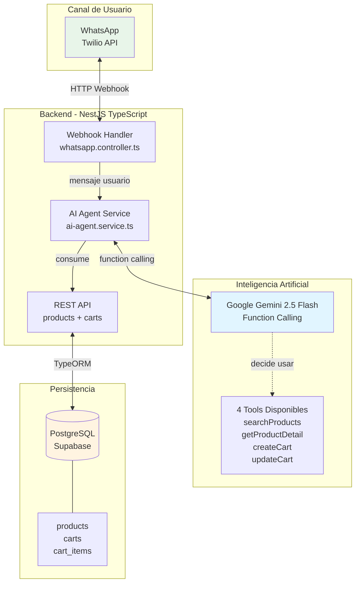
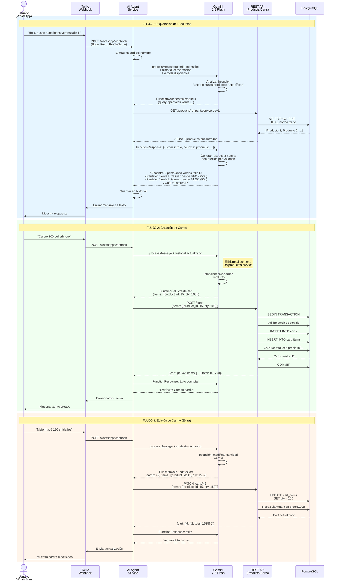

# Diseño Conceptual · Agente IA de Ventas
**Challenge Laburo.com · Customer Success Engineer**

---

## 1. Arquitectura de Alto Nivel

La solución implementa un **agente conversacional inteligente** que combina procesamiento de lenguaje natural con acciones determinísticas sobre una base de datos transaccional. El sistema permite vender productos de ropa mediante WhatsApp, sin necesidad de menús preconfigurados.

### Componentes Principales



### Características Clave del Diseño

| Componente | Tecnología | Responsabilidad |
|------------|------------|-----------------|
| **Canal** | Twilio WhatsApp Sandbox | Interface conversacional. Elimina necesidad de UI propietaria |
| **Orquestador** | NestJS 11 + TypeScript | Webhook handler, gestión de sesiones, exposición de tools |
| **Cerebro** | Google Gemini 2.5 Flash | Interpretación de intención, decisión de acciones via Function Calling |
| **Persistencia** | PostgreSQL (Supabase) | Catálogo de productos y carritos de compra |

**Principio de Diseño**: El LLM **no accede directamente** a la base de datos. Decide qué función ejecutar según la intención del usuario, y el backend ejecuta la acción validando reglas de negocio (stock, disponibilidad, etc.).

---

## 2. Flujos de Interacción del Agente

### 2.1 Diagrama de Secuencia Completo

El siguiente diagrama ilustra los **3 flujos principales** del challenge:
1. **Exploración de productos** (búsqueda y detalle)
2. **Creación de carrito** (intención de compra)
3. **Edición de carrito** (modificar cantidades - requisito extra)



### 2.2 Casos de Uso Cubiertos

| Caso | Herramienta Usada | Validaciones |
|------|-------------------|--------------|
| Búsqueda genérica ("productos") | Ninguna | Agente pregunta por especificaciones (color, talle, tipo) |
| Búsqueda específica | `searchProducts(query)` | Normalización de acentos, máx. 15 resultados |
| Ver detalle de producto | `getProductDetail(productId)` | Validar que producto existe y está disponible |
| Agregar al carrito | `createCart(items[])` | Stock suficiente, producto disponible, qty > 0 |
| Modificar cantidades | `updateCart(cartId, items[])` | Carrito existe, validar nuevo stock |
| Eliminar producto | `updateCart(cartId, [{product_id: X, qty: 0}])` | qty: 0 actúa como eliminación |

---

## 3. Endpoints REST API

Interfaz HTTP utilizada por el agente IA. Diseñada para ser consumida también por futuros frontends.

### 3.1 Productos

| Método | Endpoint | Descripción | Request | Response | Códigos |
|--------|----------|-------------|---------|----------|---------|
| **GET** | `/products` | Lista productos (opcionalmente filtrados) | Query: `?q=pantalon+verde` | `Product[]` (máx. 15) | 200, 500 |
| **GET** | `/products/:id` | Detalle completo de un producto | Param: `id` (number) | `Product` | 200, 404 |

**Modelo Product:**
```typescript
{
  id: number,
  name: string,              // "Pantalón Verde (L)"
  description: string,
  price50u: number,          // Precio 50-99 unidades
  price100u: number,         // Precio 100-199 unidades
  price200u: number,         // Precio 200+ unidades
  stock: number,
  available: boolean,
  color: string,
  size: string,              // S, M, L, XL, XXL
  type: string,              // Pantalón, Camiseta, etc.
  category: string           // Casual, Formal, Deportivo
}
```

### 3.2 Carritos

| Método | Endpoint | Descripción | Request | Response | Códigos |
|--------|----------|-------------|---------|----------|---------|
| **POST** | `/carts` | Crea carrito y agrega ítems | `{items: [{product_id, qty}]}` | `Cart` con total calculado | 201, 400, 404 |
| **GET** | `/carts/:id` | Consulta carrito con total | Param: `id` | `Cart` con items y total | 200, 404 |
| **PATCH** | `/carts/:id` | Modifica cantidades o elimina ítems | `{items: [{product_id, qty}]}` | `Cart` actualizado | 200, 400, 404 |

**Modelo Cart:**
```typescript
{
  id: number,
  created_at: Date,
  updated_at: Date,
  items: [{
    id: number,
    product_id: number,
    qty: number,
    product: Product          // Eager loaded
  }],
  total: number               // Calculado según qty y tier de precio
}
```

**Lógica de Pricing:**
- 50-99 unidades → `price50u`
- 100-199 unidades → `price100u`
- 200+ unidades → `price200u`
- Total = Σ(qty × precio_correspondiente)

---

## 4. Herramientas del Agente (Function Calling)

El agente tiene acceso a **4 herramientas declarativas** que Gemini invoca según la intención del usuario:

```typescript
// 1. Buscar productos por query
searchProducts(query: string) => {
  success: boolean,
  count: number,
  products: Product[]
}

// 2. Obtener detalle de un producto específico
getProductDetail(productId: number) => {
  success: boolean,
  product: Product
}

// 3. Crear carrito con items
createCart(items: {product_id: number, qty: number}[]) => {
  success: boolean,
  cart: { id, items, total, created_at }
}

// 4. Actualizar carrito existente (modificar o eliminar)
updateCart(cartId: number, items: {product_id: number, qty: number}[]) => {
  success: boolean,
  cart: { id, items, total, updated_at }
}
```

**Nota:** `qty: 0` en `updateCart` elimina el producto del carrito (soft delete).

---

## 5. Métricas de Éxito

### Criterios de Validación Técnica

| Métrica | Objetivo | Método de Medición |
|---------|----------|-------------------|
| **Precisión de búsqueda** | >95% de resultados relevantes | Tests E2E con queries conocidas |
| **Tiempo de respuesta** | <3s desde mensaje hasta reply | Logging con timestamps |
| **Robustez ante errores** | 100% de errores manejados gracefully | Tests de productos inexistentes, stock insuficiente |
| **Consistencia de datos** | 0 carritos con stock negativo | Validaciones en API + constraints DB |
| **Manejo de contexto** | Recordar últimos 20 mensajes | Verificar que no repite preguntas contestadas |

### Criterios de Validación Funcional

✅ **Exploración**: Usuario puede buscar y ver productos sin fricción
✅ **Compra**: Usuario puede crear carrito en lenguaje natural
✅ **Edición**: Usuario puede modificar cantidades sin crear nuevo carrito
✅ **Pricing**: Sistema aplica descuentos por volumen automáticamente
✅ **Stock**: Sistema rechaza pedidos sin stock disponible

---

## 6. Limitaciones Conocidas

### Actuales (por diseño del challenge)
- **Sin autenticación**: No hay gestión de usuarios ni sesiones persistentes
- **Historial en memoria**: Se pierde al reiniciar el servidor (producción requiere Redis)
- **Sin checkout**: Los carritos no tienen flujo de pago/confirmación final
- **Sin reducción de stock**: Crear carrito no reserva inventario
- **WhatsApp Sandbox**: Usando Twilio sandbox (producción requiere número aprobado)

### Escalabilidad Futura
- Migrar historial conversacional a **Redis** con TTL
- Implementar **rate limiting** por usuario
- Agregar **autenticación** vía WhatsApp Business API
- Integrar **pasarela de pagos** (MercadoPago, Stripe)
- Implementar **webhooks de confirmación** de pedidos
- Desplegar con **auto-scaling** (Railway, AWS ECS)

---

## 7. Stack Tecnológico Final

| Layer | Tecnología | Versión | Justificación |
|-------|------------|---------|---------------|
| Backend | NestJS | 11.x | Framework maduro con DI, modular, TypeScript nativo |
| Runtime | Node.js | 18+ | Compatible con SDK de Gemini y Twilio |
| Database | PostgreSQL | 14+ | ACID, relaciones, búsqueda full-text |
| ORM | TypeORM | 0.3.x | Auto-sync en dev, migraciones para prod |
| LLM | Google Gemini | 2.5 Flash | Function calling nativo, capa gratis, bajo latency |
| WhatsApp | Twilio API | v2010-04-01 | Setup rápido con sandbox, producción con upgrade |
| Hosting DB | Supabase | - | PostgreSQL gestionado, capa gratis generosa |

---

**Documento preparado para:** Challenge Laburo.com · Customer Success Engineer
**Fecha:** Noviembre 2024
**Versión:** 1.0
